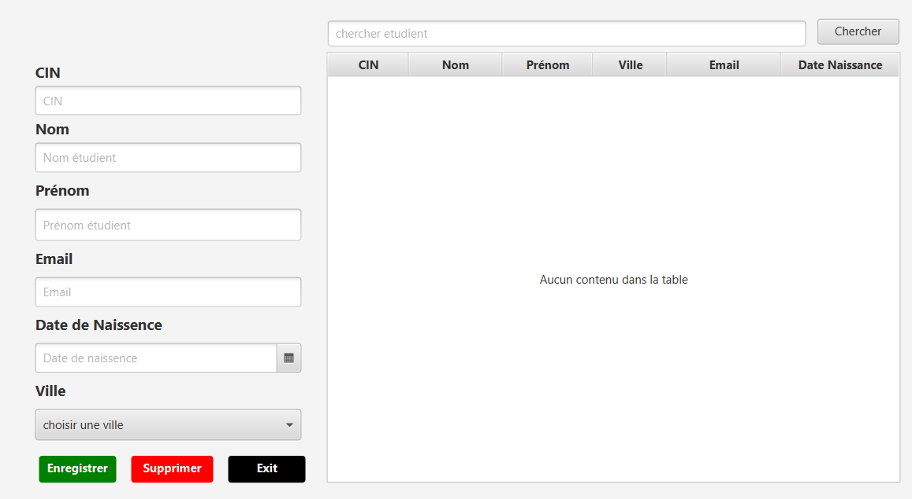

# Student Management System

This is a Java application that allows users to perform CRUD (Create, Read, Update, Delete) operations on student data. The application uses JavaFX for the user interface and JDBC for database interactions.

# Student Management System

Based on the code excerpts and the information provided, this project is a Java application that uses Maven for dependency management. The application is a student management system, with functionalities to perform CRUD operations on student data. The application uses JavaFX for the user interface and JDBC for database interactions.

## Technologies Used

1. **Java:** The main programming language used in the project.
2. **Maven:** A build automation tool used primarily for Java projects.
3. **JavaFX:** A software platform for creating and delivering desktop applications.
4. **JDBC:** Java Database Connectivity (JDBC) is an API for the programming language Java, which defines how a client may access a database.

## Project Structure

- `src/main/java/com/example/studentapp/DAO`: This package contains the Data Access Object (DAO) classes for your application. These classes are responsible for interacting with the database.
- `src/main/java/com/example/studentapp/presentation`: This package contains the classes responsible for the user interface of your application.
- `pom.xml`: This is the Project Object Model (POM) file for your Maven project. It contains information about the project and configuration details used by Maven to build the project.

## Features

- CRUD operations on student data: The application allows users to create, read, update, and delete student data.
- Search for students: Users can search for students by name or ID.
- User-friendly interface: The application uses JavaFX to provide a user-friendly interface.

## Setup

- Clone the repository: `git clone https://github.com/YassinMk/student-management-system.git`
- Navigate to the project directory: `cd student-management-system`
- Run the application: `mvn javafx:run`

## License

- This project is licensed under the MIT License.

Please note that this is a high-level overview of your project. For a more detailed analysis, you might want to consider using a static code analysis tool or a code review tool.

## Features:  
CRUD operations on student data: The application allows users to create, read, update, and delete student data.
Search for students: Users can search for students by name or ID.
User-friendly interface: The application uses JavaFX to provide a user-friendly interface.

## Screenshots

## Setup

To run this project, you need to have Java and Maven installed on your machine.

1. Clone the repository: `git clone https://github.com/YassinMk/student-management-system.git`
2. Navigate to the project directory: `cd student-management-system`
3. Run the application: `mvn javafx:run`

## License

This project is licensed under the MIT License - see the [LICENSE.md](LICENSE.md) file for details.